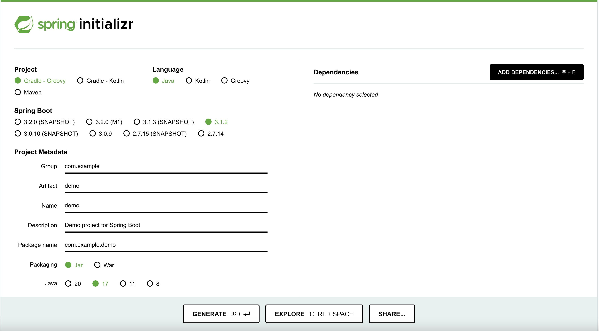
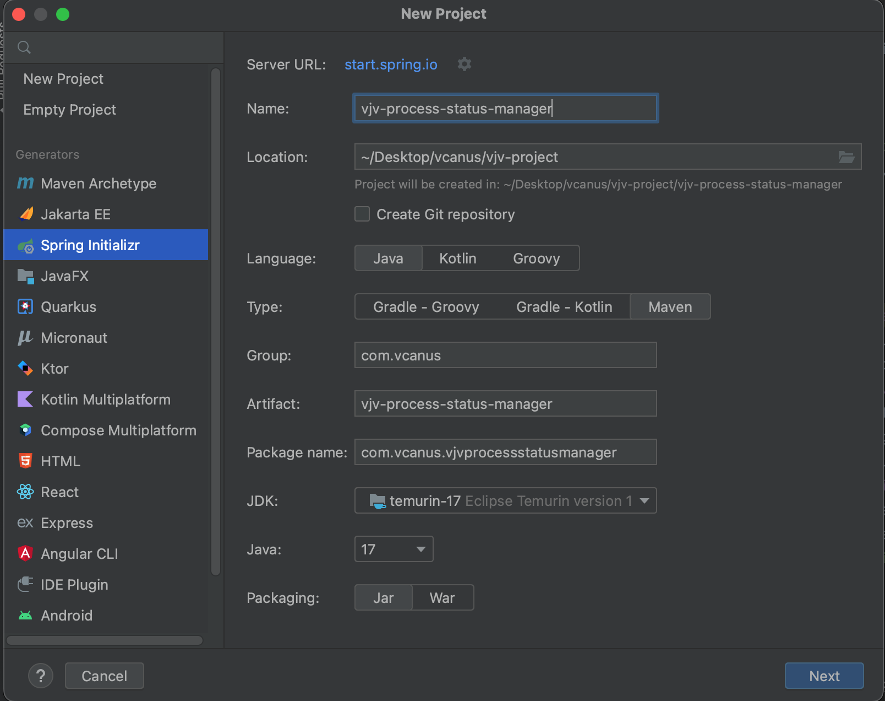

Written By Tae-hwa Seo

# Spring Boot
스프링으로 애플리케이션을 만들 때에 필요한 설정을 간편하게 처리해주는 별도의 프레임워크

## Spring Boot를 활용하여 Project 만들기

### 1. https://start.spring.io/ 에서 프로젝트 생성



1. https://start.spring.io/ 접속
2. project : 빌드 툴 선택
3. language : 프로젝트에 사용하고자하는 프로그래밍 언어 선택
4. Spring Boot : 스프링부트 버전 선택. 버전 이름 뒤 아무것도 붙어 있지 않은 버전 중 가장 최신 버전 선택
   *  SNAPSHOT: 개발이 아직 완료되지 않은 버전
   *  M(Milestone) : 개발은 완료 되었으나, 기능 개선 or 버그 수정 중인 버전
   *  RC(Release Candidate) : 기능 개선과 버그 수정 완료되었으나, 최종 릴리즈 되지 않은 버전
5. Project Metadata : 프로젝트 정보 입력
   * Group : 프로젝트를 만드는 그룹 이름
   * Artifact : 빌드 결과물의 이름
   * Name : 프로젝트의 이름
   * Description : 프로젝트에 대한 설명
   * Package name : 프로젝트에 생성할 패키지 설정
   * Packaging : 배포를 위해 프로젝트를 압축하는 방법 선택
   * Java : JDK 버전 선택
6. Dependencies : ADD DEPENDENCIES 버튼을 통해 애플리케이션의 동작에 필요한 라이브러리 선택
7. GENERATE 클릭하여 프로젝트 생성
8. 다운로드 된 압축 파일 압축 해제 후 인텔리제이에서 프로젝트 열기


### 2. IntelliJ project 생성 시 'Spring Initializr' 바로 적용 (IntelliJ Ultimate Edition 버전)



1. 인텔리제이 실행
2. 새 프로젝트 생성
3. 좌측 Generators tab에서 Spring Initializr 선택
4. 프로젝트 정보 입력 후 NEXT
   * Name : 프로젝트의 이름
   * Location : 프로젝트 저장 위치
   * Language : 프로젝트에 사용하고자하는 프로그래밍 언어 선택
   * Type : 빌드 툴 선택
   * Group : 프로젝트를 만드는 그룹 이름
   * Artifact : 빌드 결과물의 이름
   * Package name : 프로젝트에 생성할 패키지 설정
   * JDK, Java : JDK, Java 버전 선택
5. Dependencies 추가 화면에서 어플리케이션의 동작에 필요한 라이브러리 선택
6. Create 버튼 클릭하여 프로젝트 생성

## pom.xml 설정
추가로 필요한 라이브러리를 셋팅 가능
* dependency 설정 추가 예시

``` xml
<!-- https://mvnrepository.com/artifact/org.slf4j/slf4j-api -->
<dependency>
    <groupId>org.slf4j</groupId>
    <artifactId>slf4j-api</artifactId>
    <version>2.0.7</version>
</dependency>

<!-- https://mvnrepository.com/artifact/ch.qos.logback/logback-classic -->
<dependency>
    <groupId>ch.qos.logback</groupId>
    <artifactId>logback-classic</artifactId>
    <version>1.4.8</version>
</dependency>

<!--    vjv-communication-api    -->
<dependency>
    <groupId>com.vcanus</groupId>
    <artifactId>vjv-communication-api</artifactId>
    <version>3.8.0-SNAPSHOT</version>
</dependency>

<!--    nats    -->
<dependency>
    <groupId>com.vcanus</groupId>
    <artifactId>vjv-nats</artifactId>
    <version>2.16.5-SNAPSHOT</version>
</dependency>

<!--    zookeeper    -->
<dependency>
    <groupId>org.apache.zookeeper</groupId>
    <artifactId>zookeeper</artifactId>
    <version>3.8.0</version>
</dependency>

<!--    vjv-util    -->
<dependency>
    <groupId>com.vcanus</groupId>
    <artifactId>vjv-util</artifactId>
    <version>0.0.1-SNAPSHOT</version>
</dependency>
```

* **Spring Boot 버전에 호환되는 라이브러리의 버전을 선택해야함**